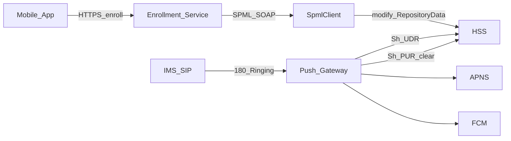

# Token Enrollment API (SPML) — Plan

**Status:** Implemented (separate project at [push-token-enrollment/](push-token-enrollment/))
**Decisions:** Separate microservice (1B); pluggable `SpmlClient` with SOAP SPML 2.0 default + mock (2C)

Related: [caller-display.md](caller-display.md) (push gateway — Sh UDR read / PUR purge only).

---

## 1. Decisions (locked)

| Choice | Selection |
|---|---|
| Deploy model | **Separate microservice** — own WAR/deployable; push gateway stays Sh **UDR read** + **PUR purge** only |
| SPML target | **Pluggable `SpmlClient`** — default SOAP **SPML 2.0** client + in-memory mock for CI; vendor HSS/broker adapters later |

---

## 2. Role split



| Component | Responsibility |
|---|---|
| **Enrollment service (new)** | Write path: app → API → SPML → HSS `RepositoryData` |
| **Push gateway (existing)** | Read/purge: SIP 180 → UDR → push; 410/UNREGISTERED → PUR clear |

---

## 3. Product flow

When the user enables voice-call notifications:

1. App obtains APNs **VoIP** token (iOS) or FCM registration token (Android).
2. App calls enrollment API with subscriber identity + token + platform.
3. Service validates, normalizes MSISDN, resolves destination realm (same rules as gateway).
4. Service issues SPML to create/update HSS repository data under `ServiceIndication=PushNotificationAppV1` with `<DeviceToken>`, `<Platform>`, bumped `<SequenceNumber>`.
5. Later ringing events are served by the existing push gateway via UDR (no change for happy path).

---

## 4. API surface

**Base path:** `/v1/push-tokens`  
**Auth:** OAuth2 bearer (scope `push.enroll`). Fail closed if missing/invalid.

| Method | Path | Purpose |
|---|---|---|
| `PUT` | `/v1/push-tokens/{msisdn}` | Upsert token (idempotent) |
| `DELETE` | `/v1/push-tokens/{msisdn}` | Clear token (user disables notifications) |
| `GET` | `/v1/push-tokens/{msisdn}` | Optional: platform + token fingerprint only (full token off by default) |

**`PUT` body:**

```json
{
  "platform": "APNS",
  "deviceToken": "<apns-voip-or-fcm-token>",
  "appId": "com.example.app.voip",
  "sequenceHint": null
}
```

| Field | Rules |
|---|---|
| `platform` | `APNS` \| `FCM` only |
| `deviceToken` | Non-blank; max length configurable (default 4096) |
| `{msisdn}` | Normalize to E.164 (`default-country-code`, trunk strip) |
| Idempotency | Same MSISDN + same token → success; token change → SPML modify with `SequenceNumber+1` |

**Responses:** `204`/`200` success; `400` validation; `401`/`403` auth; `404` unknown subscriber; `502` SPML failure; `429` rate limit.

---

## 5. HSS repository payload (SPML target)

Align with [caller-display.md](caller-display.md) §3.2:

```xml
<RepositoryData>
  <ServiceIndication>PushNotificationAppV1</ServiceIndication>
  <SequenceNumber>{n}</SequenceNumber>
  <ServiceData>
    <PushTokenStorage>
      <DeviceToken>{token}</DeviceToken>
      <Platform>APNS|FCM</Platform>
    </PushTokenStorage>
  </ServiceData>
</RepositoryData>
```

`DELETE` / disable → empty `<DeviceToken>` (same shape the gateway uses on purge).

---

## 6. SPML design

### Interface

```java
public interface SpmlClient {
  SpmlResult upsertPushToken(SubscriberId id, PushTokenRecord token, long nextSequence);
  SpmlResult clearPushToken(SubscriberId id, long nextSequence);
}
```

### Default: `SoapSpml20Client`

- SOAP over HTTPS to `enrollment.spml.endpoint`
- SPML 2.0 `modifyRequest` (or `addRequest` when create-if-absent is required)
- PSO / identifier → `tel:+E164` (or configured IMPU form)
- Modification payload → repository XML (or attribute map the broker maps to HSS)
- mTLS / client cert from keystore (same `KEYSTORE_PASSWORD` posture as gateway)
- Timeouts + circuit breaker; logs use **token fingerprint** only (SHA-256 prefix)

### Test double: `MockSpmlClient`

- In-memory `msisdn → (token, platform, sequence)`
- `enrollment.spml.transport=mock|soap`

### Later (interface only in v1)

- Vendor-direct HSS SPML
- Vault-injected SPML credentials

---

## 7. Suggested repo layout

```
caller-display/                    # existing push gateway WAR (unchanged write path)
push-token-enrollment/             # NEW Maven module / sibling project
  src/main/java/.../enrollment/
    api/PushTokenResource.java
    api/PushTokenRequest.java
    identity/MsisdnNormalizer.java   # duplicate small helpers in v1; shared JAR later
    realm/RealmResolver.java
    spml/SpmlClient.java
    spml/SoapSpml20Client.java
    spml/MockSpmlClient.java
    spml/SpmlPayloadFactory.java
    security/EnrollmentAuthFilter.java
  src/main/liberty/config/server.xml
  src/test/.../EnrollmentApiIT.java
  src/test/.../SoapSpmlClientWireMockTest.java
```

Do **not** couple the enrollment deployable to SIP servlet classes.

---

## 8. Config (MP Config)

```
enrollment.spml.transport=mock|soap
enrollment.spml.endpoint=https://prov.example.net/spml
enrollment.spml.connect-timeout-ms=2000
enrollment.spml.read-timeout-ms=5000
enrollment.spml.service-indication=PushNotificationAppV1
enrollment.msisdn.default-country-code=1
enrollment.realm.default-destination-realm=ims.mnc001.mcc001.3gppnetwork.org
enrollment.auth.jwks-url=https://idp.example.net/jwks
enrollment.rate-limit.per-second=50
```

Secrets via env / Vault placeholders — never hardcoded.

---

## 9. Security and abuse

- Private API gateway / mTLS in front (not raw public internet)
- AuthZ: token subject matches `{msisdn}` or admin scope
- Rate limit per subject / IP
- No full device tokens in logs
- Input size limits; reject unknown platforms

---

## 10. Observability

| Metric | Notes |
|---|---|
| `enrollment_upsert_total{platform,result}` | success / validation / spml_error |
| `enrollment_spml_latency_seconds` | histogram |
| `enrollment_clear_total` | deletes |

MDC: `requestId`, `platform`, MSISDN fingerprint — never raw token.

---

## 11. Delivery phases (TDD)

| Phase | Deliverable |
|---|---|
| **E0** | Module skeleton, MP Config, `MockSpmlClient`, OpenAPI sketch |
| **E1** | JAX-RS `PUT`/`DELETE` + validation + auth fail-closed + unit tests |
| **E2** | `SpmlPayloadFactory` RepositoryData XML + sequence bump |
| **E3** | `SoapSpml20Client` + WireMock SOAP fixtures; timeouts / breaker |
| **E4** | Liberty `server.xml`, `ops/enrollment/` runbook, CI job |
| **E5** | Staging: real SPML broker; verify push gateway UDR sees enrolled token |

---

## 12. Non-goals (v1)

- Push gateway writing tokens via Diameter PUR (SPML is the write path)
- Cross-node cache invalidation after enroll (TTL still applies)
- Vendor-proprietary HSS SPML dialects beyond the pluggable interface

---

## 13. Docs when implementing

- Sibling spec `push-token-enrollment.md` (API + SPML mapping)
- Short pointer in [caller-display.md](caller-display.md): “Token provisioning is out of band (enrollment service)”
- `ops/enrollment/spml-runbook.md`
